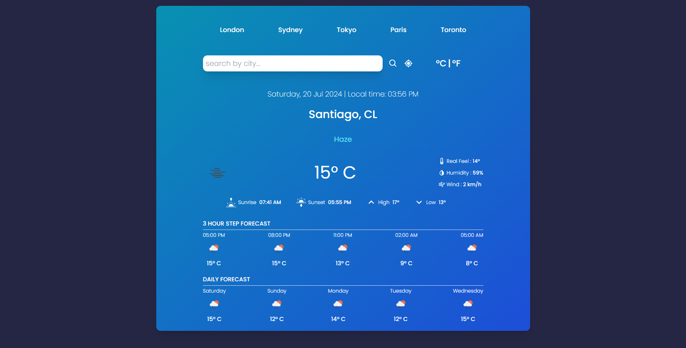

# WeatherAPI

Proyecto realizado con React y llamadas a API.

## Tecnologías Utilizadas

- React
- Llamadas a API
- Tailwind

## Captura de Pantalla

## Licencia
Parte del proyecto fue realizado siguiendo el tutorial de Yash Patel, pero mejorado y con algunos cambios.
[Tutorial de Yash Patel](https://www.youtube.com/@yashpatel1O1)